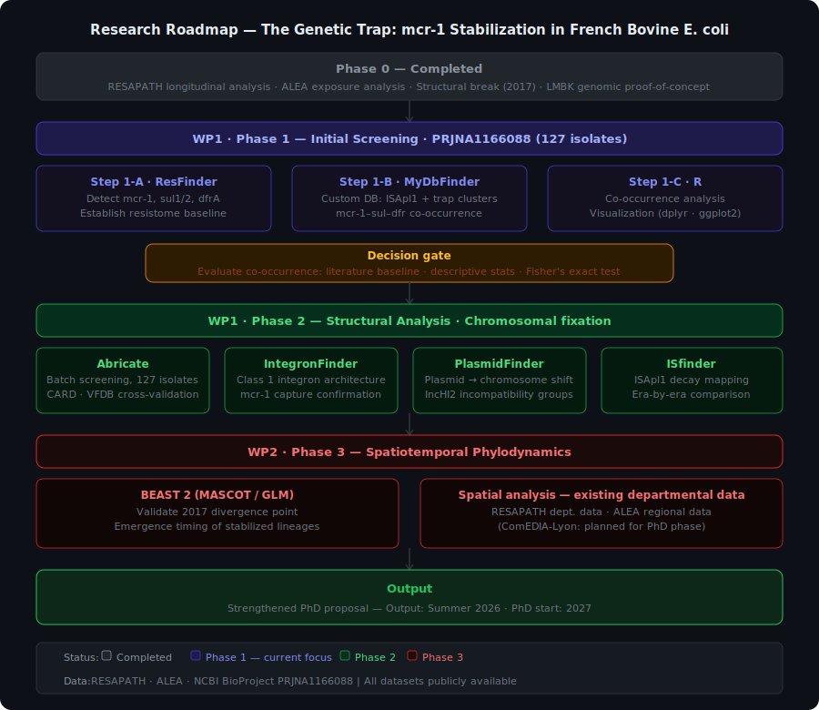

# Unintended Consequences of Antibiotic Stewardship: The Genetic Trap and Genomic Stabilization of *mcr-1* in the French One Health Interface

**Author:** Makiko FUJITA-SUZANNE  
**Last updated:** April 2026  
**Status:** Active — Pilot Study in Progress (2026)

---

## Overview

This repository serves as the central hub for my independnt pilot research project, which underpins a PhD proposal (expected start: Autumn 2027). The project investigates the **"Ecoantibio Paradox"**: despite a dramatic reduction in colistin use in the French bovine sector, phenotypic colistin resistance has stabilized and rebounded since 2019 — defying the conventional "usage-resistance" dogma.

I hypothesize that this paradox signals a fundamental evolutionary shift: a **plasmid-to-chromosome transition** of the *mcr-1* gene, driven by the substitution of colistin with Category D antibiotics (trimethoprim-sulfonamides). Once chromosomally integrated, resistance becomes autonomous and impervious to stewardship interventions — what I term the **"Genetic Trap"**.

---

## The Core Hypothesis

The "Genetic Trap" operates through two sequential mechanisms:

1. **Co-selection**: Use of trimethoprim-sulfonamides selects for Class 1 integrons carrying *sul1/dfrA*, which physically capture and maintain the *mcr-1* transposon — even in the absence of colistin.
2. **Stabilization**: Insertion Sequence (*ISApl1*) decay permanently locks *mcr-1* into the chromosome, neutralizing fitness costs and enabling clonal vertical transmission.

This implies a three-phase evolutionary trajectory:

| Phase | Period | Mechanism | Driver |
|---|---|---|---|
| Mobilization | 2006–2016 | Plasmid-borne, HGT-driven | Colistin exposure (r = 0.86, p < 0.001) |
| Decoupling & Stabilization | 2017–2020 | IS decay → chromosomal fixation | Structural break (p < 0.001) |
| Clonal Expansion | 2021–present | Vertical transmission, autonomous | Independent of antibiotic pressure (R² = 0.26) |

---

## Pilot Study (2026): PRJNA1166088

The 2026 pilot study targets **BioProject PRJNA1166088** — 127 *E. coli* isolates from French cattle (Haenni et al., 2017) — as a representative dataset for Phase 2 (Stabilization).

### WP1 / Step 1: Initial Screening

Establishing the genetic baseline across all 127 isolates:

- **ResFinder**: Detection of acquired AMR genes — specifically *mcr-1*, *sul1/2*, and *dfrA*
- **MyDbFinder**: Targeted screening using a custom database ([`integron_trap_db.fasta`](https://github.com/Marocco101/bovine_mcr1_genomics/blob/main/integron_trap_db.fasta)) to detect *ISApl1* sequences and "trap" architectures (*mcr-1–sul–dfr* clusters)
- **R**: Co-occurrence analysis and visualization (dplyr, ggplot2)

### WP1 / Step 2: Advanced Structural Analysis

Characterizing the physical stabilization of resistance genes:

- **Abricate**: Batch screening, 127 isolates; cross-validation against CARD and VFDB databases
- **IntegronFinder**: Definition of Class 1 integron architecture; confirmation that *mcr-1* is physically "captured"
- **PlasmidFinder**: Identification of plasmid incompatibility groups (e.g., IncHI2); quantification of the plasmid-to-chromosome transition
- **ISfinder**: Mapping of *ISApl1* decay across the three evolutionary eras

### WP2 / Spatiotemporal Analysis

- **BEAST 2 (MASCOT/GLM)**: Validation of the 2017 divergence point; emergence timing of stabilized lineages
- **Spatial analysis**: Departmental-level dissemination patterns using existing RESAPATH and ALEA data — *note: ComEDIA-Lyon high-resolution environmental data planned for PhD phase only*

---

## Repository Structure

```
bovine_mcr1/
├── README.md               ← This file
└── (analyses in progress)
```

### Related Repositories

| Repository | Description | Status |
|---|---|---|
| [bovine_mcr1_exposure](https://github.com/Marocco101/bovine_mcr1_exposure) | Colistin exposure vs. resistance (ALEA data) | ✔️ Complete |
| [bovine_mcr1_longitudinal](https://github.com/Marocco101/bovine_mcr1_longitudinal) | Longitudinal decoupling analysis (2006–2024) | ✔️ Complete |
| [bovine_mcr1_genomics](https://github.com/Marocco101/bovine_mcr1_genomics) | Genomic proof-of-concept (EC590 reference strain) | ✔️ Complete |
| [bovine_mcr1_spatial](https://github.com/Marocco101/bovine_mcr1_spatial) | Spatial correlation at departmental level | ✔️ Complete |

---

## Key Preliminary Findings

From analyses already completed and published in the related repositories above:

- **Statistical decoupling**: A structural break in 2017 was identified in RESAPATH data (2006–2024). Colistin resistance was strongly correlated with TMP-SMX in Phase 1 (r = 0.85, p < 0.001), but this association collapsed in Phase 2 (r = 0.51, R² = 0.26).
- **Genomic redundancy**: Analysis of a high-risk 2016 isolate (LMBK) identified *mcr-1* co-harbored with *sul1/dfrA1* and *sul2/dfrA36* on the chromosome — direct evidence of the "Genetic Trap" architecture.
- **Spatial decoupling**: No significant correlation between departmental TMP-SMX co-selection pressure and colistin resistance in 2009 (r = 0.09, p = 0.61) or 2024 (r = −0.12, p = 0.52), suggesting dissemination is driven by environmental pathways rather than farm-level usage.

---

## Data Sources

All analyses use publicly available data. No proprietary datasets are involved.

- **RESAPATH**: Réseau d'épidémiosurveillance de l'antibiorésistance des bactéries pathogènes animales — [resapath.anses.fr](https://resapath.anses.fr/)
- **ALEA**: Agence nationale du médicament vétérinaire — French veterinary antimicrobial sales data
- **NCBI / BioProject PRJNA1166088**: 127 bovine *E. coli* isolates, France (Haenni et al., 2017)

---

## Roadmap

 

**Phase 0 — Completed**
- [x] Exposure analysis (ALEA vs. RESAPATH)
- [x] Longitudinal decoupling analysis (structural break identification)
- [x] Genomic proof-of-concept (EC590 reference strain)
- [x] Spatial correlation at departmental level (RESAPATH)

**WP1 · Phase 1 — Current focus**
- [ ] Pilot screening of PRJNA1166088 (ResFinder, MyDbFinder, R)
- [ ] Co-occurrence evaluation: literature baseline · descriptive stats · Fisher's exact test

**WP1 · Phase 2**
- [ ] Structural analysis (Abricate, IntegronFinder, PlasmidFinder, ISfinder)
- [ ] ISApl1 decay quantification across evolutionary eras

**WP2 · Phase 3**
- [ ] BEAST 2 phylodynamic analysis (2017 divergence point)
- [ ] Spatial dissemination analysis using existing departmental data
- [ ] ComEDIA-Lyon environmental data *(planned for PhD phase)*

**Output**
- [ ] Strengthened PhD proposal — Summer 2026
- [ ] PhD application — Spring 2027
- [ ] PhD start — 2027

---

## Selected References

- Haenni, M. et al. (2017). Increasing trends in *mcr-1* prevalence among ESBL-producing *E. coli* isolates from French calves despite decreasing exposure to colistin. *Antimicrobial Agents and Chemotherapy*, 60(10), 6433–6434.
- Haenni, M. et al. (2025). No genetic link between *E. coli* isolates carrying *mcr-1* in bovines and humans in France. *Journal of Global Antimicrobial Resistance*, 41, 111–116.
- Liu, Z. et al. (2021). Genetic features of plasmid- and chromosome-mediated *mcr-1* in *E. coli* isolates from animal organs with lesions. *Frontiers in Microbiology*, 12, 707332.

---

## About

This project is an independent research initiative. All analyses use publicly available datasets and are fully documented for transparency and reproducibility.

**Contact**: makiko.fujitasuzanne@gmail.com  
**GitHub**: [github.com/Marocco101](https://github.com/Marocco101)
